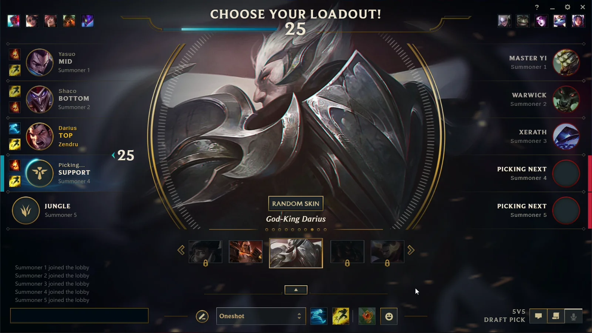

# League of Legends Happiness Therapy System

Ever get so tilted playing League that you forget how to smile? Fear not! 

This silly effective system uses your webcam to watch for genuine smiles. When you stop smiling for too long, it kicks you out of League and opens YouTube guides to help you get better (for your specific champion, too!).




## Dependencies

```
opencv-python
dlib
numpy
pytesseract
psutil
```

**Installation Notes**:
- **miniconda**: `conda` advised, project works only with `Python=3.10`!
- **dlib**: Requires cmake and boost libraries
- **pytesseract**: Requires Tesseract OCR engine installation (OS Specific build!)
- **81-point model**: Download `shape_predictor_81_face_landmarks.dat` from `https://github.com/codeniko/shape_predictor_81_face_landmarks` and put in project directory 

## Key Features

### Face Monitoring and Smile Detection
- 81-point facial landmark tracking
- Smile detection that combines mouth and eye movements (can't fake it!)
- Dynamic happiness meter that increases when you smile, decreases when you don't
- Comprehensive debug windows showing what the computer sees of your face
- Automatic intervention system with countdown timer (last chance to smile!)

### Champion Detection (Text Recognition)
- Highly accurate champion recognition (80%+ success rate)
- Sophisticated image processing that handles white text on dark backgrounds (League specific environment)
- Targeted scanning for champion select screen
- Debug image output

### Intervention System
- League client termination that finds and closes all League processes
- YouTube guide integration that searches for educational content about your champion
- Flexible configuration through JSON files

The core concept: when you're obviously miserable (happiness hits zero), the system intervenes and boots you from the game, then opens helpful YouTube guides so you can learn and return stronger.

## Technology Choices and Rationale

### Computer Vision Framework

**OpenCV (cv2)**
- **Selection rationale**: Industry-standard computer vision library with proven performance for real-time applications
- **Implementation role**: Webcam capture, image processing, window management, and real-time display
- **Key advantages**: Excellent integration with dlib, comprehensive image processing capabilities
- **Alternative considered**: PIL/Pillow (insufficient for real-time video processing requirements)

**dlib with 81-point facial landmarks**
- **Selection rationale**: Mature, reliable facial landmark detection for real-time shape detection
- **Why 81 points over 68**: The additional landmarks are placed on the forehead, I personally dont use it, but it will help catch the face if the user is wearing a hat.
- **Implementation role**: Face detection, precise landmark extraction, geometric feature calculation

**NumPy**
- **Selection rationale**: Essential array operations and calculations
- **Implementation role**: Landmark coordinate, distance calculations

### Text Recognition and Process Management

**Tesseract OCR (pytesseract)**
- **Selection rationale**: Most configurable open-source OCR engine with extensive parameter tuning options
- **Implementation role**: Champion name extraction from screenshots with custom preprocessing just for League champ select
- **Alternative considered**: EasyOCR (less configuration flexibility), AWS Textract ($$$$$$$$)

**psutil**
- **Implementation role**: Detection and termination of League of Legends client processes

## Technical Challenges and Solutions

### Challenge 1: `dlib` face landmarks
```python
# Using dlib's face detector with the 81-point model
self.detector = dlib.get_frontal_face_detector()
self.predictor = dlib.shape_predictor("shape_predictor_81_face_landmarks.dat")

# Handle all detected faces with extensive error checking
for face in faces:
    landmarks = self.predictor(gray, face)
    # Extract regions of interest with appropriate padding
```

**Why 81 points over 68**: Those additional 13 landmarks provide better face detection in hats. (Additional landmarks are on the forehead) 

### Challenge 2: Developing Reliable Smile Detection
**The Problem**: Initial smile detection attempts were completely unreliable - triggering on speech, yawning, and other non-smile facial expressions.

**Evolution of the solution**:

1. Mouth shape analysis only → Failed because talking can resemble smiling
2. Added eye analysis because genuine smiles involve eye squinting → Dramatically improved accuracy
3. Fine-tuned threshold values through extensive testing

```python
def detect_smile(self, landmarks):
    # Analyze eye squinting (width vs height ratio)
    left_eye_ratio = self.calculate_eye_aspect_ratio(landmarks, "left_eye")
    right_eye_ratio = self.calculate_eye_aspect_ratio(landmarks, "right_eye")
    
    # Analyze mouth opening width
    mouth_ratio = self.calculate_mouth_aspect_ratio(landmarks)
    
    # Both conditions must be satisfied for genuine smile detection
    mouth_is_smiling = mouth_ratio > mouth_threshold
    eyes_are_squinting = (left_eye_ratio + right_eye_ratio) / 2 > eyes_threshold
    
    return mouth_is_smiling and eyes_are_squinting
```

**Key discovery**: Authentic smiles involve both mouth movement AND eye squinting (Duchenne markers). Eliminates false positives from speech and fake smiles.

### Challenge 3: Extracting Facial Regions Robustly
**The Problem**: Needed to extract eye and mouth regions from faces of varying sizes and positions without causing application crashes.

```python
def extract_region(self, frame, landmarks, region_name):
    # Collect all landmark points for this facial feature
    region_points = []
    for i in range(landmark_config["start"], landmark_config["end"] + 1):
        point = landmarks.part(i)
        region_points.append([point.x, point.y])
    
    # Calculate bounding box with padding buffer
    x_min = np.min(region_points[:, 0]) - padding
    x_max = np.max(region_points[:, 0]) + padding
    # ... with boundary validation to prevent array access errors
```

**Why this approach works**: 
- **Automatic scaling**: Bounding boxes automatically adjust for different face sizes
- **Safety padding**: Extra space around features compensates for landmark detection imprecision

### Challenge 4: Smile formula

**Eye aspect ratio calculation**:
```python
def calculate_eye_aspect_ratio(self, landmarks, eye_type):
    eye_points = np.array([[landmarks.part(i).x, landmarks.part(i).y]
                           for i in range(start, end)])
    
    eye_width = np.linalg.norm(eye_points[3] - eye_points[0])  # Horizontal span
    eye_height = np.linalg.norm(eye_points[1] - eye_points[4])  # Vertical span
    
    return eye_width / eye_height
```

**Underlying principle**: Genuine smiles cause eyes to become squinted, increasing the width-to-height ratio.

**Mouth aspect ratio calculation**:
```python
def calculate_mouth_aspect_ratio(self, landmarks):
    mouth_points = np.array([[landmarks.part(i).x, landmarks.part(i).y]
                             for i in range(48, 68)])  # Complete mouth region
    
    mouth_width = np.linalg.norm(mouth_points[6] - mouth_points[0])   # Corner-to-corner
    mouth_height = np.linalg.norm(mouth_points[9] - mouth_points[3])  # Top-to-bottom
    
    divisor = self.config["smile_detection"]["mouth_ratio_divisor"]
    return mouth_width / mouth_height / divisor
```

**Rationale for the divisor**: Mouth width naturally dominates the ratio (so divide value by 1.5).

**Threshold determination process**:
- **Mouth threshold (1.8)**: Established through empirical testing with genuine versus forced smile samples
- **Eye threshold (2.3)**: Balanced to detect squinting while avoiding false triggers from normal blinking
- **Combined validation**: Both conditions must be satisfied simultaneously - prevents cheating

**Formula**: Time-based system that changes gradually:
```python
def update_happiness(self, is_smiling):
    current_time = time.time()
    time_diff = current_time - self.last_update_time
    
    if is_smiling:
        self.current_happiness = min(100.0, self.current_happiness +
                                   fill_rate * time_diff * 100)
    else:
        self.current_happiness = max(0.0, self.current_happiness -
                                   decay_rate * time_diff * 100)
```

**Why this formula?**:
- No lag but real-time
- Feels more natural than instant jumps (you have to produce gain in the progress bar with time)
Prevents the system from triggering just because you stopped smiling for a brief moment

### Challenge 5: OCR Implementation for champion select

**Region Detection Accuracy**
**Problem**: Initial region detection was capturing too much of the screen or missing the champion name area.

**Solution**: Multi-stage region extraction system:
```python
# Bottom region targeting
bottom_height = int(height * bottom_offset_ratio)
# Horizontal centering  
horizontal_width = int(width * horizontal_center_ratio)
# Smart trimming to remove UI elements
roi = roi[top_trim_pixels:, :]  # Remove "RANDOM SKIN" text
```

**White Text on Dark Background**
**Problem**: OCR engines are optimized for black text on white backgrounds, but League uses white text on dark backgrounds.

**Solution**: Automatic image inversion based on brightness analysis:
```python
mean_intensity = np.mean(processed)
if mean_intensity < 128:  # Dark background detected
    processed = cv2.bitwise_not(processed)  # Invert colors
```


## Configuration Parameters Deep Dive

### Facial Recognition Configuration (`therapy`)

#### Landmark Regions
```json
"landmarks": {
    "left_eye": {"start": 36, "end": 41},
    "right_eye": {"start": 42, "end": 47}, 
    "mouth": {"start": 48, "end": 67}
}
```
**Rationale for these ranges**: Based on dlib's 81-point model specification. These ranges capture:
- **Eyes (36-41, 42-47)**: Complete eye contour including corners for accurate width/height calculations
- **Mouth (48-67)**: Full mouth region

#### Region Padding
```json
"regions": {
    "left_eye": {"padding": 15},
    "right_eye": {"padding": 15},
    "mouth": {"padding": 20}
}
```
**Rationale for different padding values**: 
- **Eyes (15px)**: Smaller padding since eye detection tends to be more precise
- **Mouth (20px)**: Larger padding because mouth movements can extend beyond landmark boundaries

#### Smile Detection Thresholds
```json
"smile_detection": {
    "mouth_ratio_threshold": 1.8,
    "eyes_ratio_threshold": 2.3,
    "mouth_ratio_divisor": 1.5
}
```

**`mouth_ratio_threshold: 1.8`**
- **Purpose**: Minimum mouth width/height ratio indicating smiling
- **Selection process**: Determined through testing
- **Testing methodology**: Recorded genuine smiles versus speech/neutral expressions
- **Operational range**: 1.5-2.2

**`eyes_ratio_threshold: 2.3`**
- **Purpose**: Minimum eye width/height ratio indicating squinting behavior
- **Selection rationale**: Balances sensitivity with false positive prevention
- **Key finding**: Genuine smiles consistently produce eye ratios exceeding 2.3
- **Operational range**: 2.0-2.6 (lower too sensitive to normal eye movement, higher misses genuine smiles -- makes you force a fake)

**`mouth_ratio_divisor: 1.5`**
- **Purpose**: Arbitrary divisor to keep numbers below threshold

#### Happiness Mechanics
```json
"happiness": {
    "decay_rate": 0.5,
    "fill_rate": 0.5,
    "start_value": 50.0,
    "zero_action_delay": 5.0
}
```
### Champion Detection (OCR) Configuration

#### Region Detection
```json
"region": {
    "bottom_offset_ratio": 0.1,
    "horizontal_center_ratio": 0.2,
    "vertical_center_ratio": 4.0,
    "top_trim_pixels": 42,
    "bottom_trim_ratio": 0.92
}
```

**`bottom_offset_ratio: 0.1`** - Focus on bottom 10% where champion names appear
**`horizontal_center_ratio: 0.2`** - Capture 20% width centered horizontally  
**`top_trim_pixels: 42`** - Remove exact pixels containing "RANDOM SKIN" UI text
**`bottom_trim_ratio: 0.92`** - Keep top 92% of region, removing bottom UI elements

#### Preprocessing Pipeline
```json
"preprocessing": {
    "contrast_alpha": 1.8,
    "threshold_value": 180,
    "invert_for_white_text": true,
    "use_adaptive_threshold": true,
    "enhance_contrast": true
}
```

**`contrast_alpha: 1.8`** - Enhances text contrast without oversaturation
**`invert_for_white_text: true`** - Auto-detects and inverts white text on dark backgrounds
**`use_adaptive_threshold: true`** - Better than fixed thresholding for varying conditions

## System Workflow

### Main Application Flow
1. OCR extracts champion name from screenshot
2. Webcam-based happiness monitoring begins
3. Continuous smile detection and happiness tracking
4. When happiness reaches 0% for 5+ seconds
5. League client termination followed by educational content delivery

### Intervention System
```python
def zero_happiness_action(self):
    chill()  # Terminate League client processes
    open_guide_for_champion(self.champion)  # Open YouTube guides
    exit(0)  # End therapy session
```

**Design Philosophy**: Don't hate the player - hate the game. This terminates the League process.

## Usage Examples

### Basic Therapy Session
```python
from therapy import Therapist
from screen import ChampionDetector

# Detect champion from screenshot
champion = ChampionDetector().get_champion_from_file("champ_select.webp")

# Start therapy session
therapist = Therapist(champion=champion)
therapist.run()  # Begins webcam monitoring
```

### Debug Mode
The system provides extensive debug visualization:
- **Main Feed**: Live webcam with face detection overlay
- **Left Eye**: Extracted and scaled left eye region
- **Right Eye**: Extracted and scaled right eye region  
- **Mouth**: Extracted and scaled mouth region
- **Smile Detection**: Real-time smile analysis with thresholds
- **Happiness Meter**: Visual happiness level with countdown timer

## Known Limitations

### Facial Recognition
- **Lighting dependency**: Poor performance in very dark or bright conditions
- **Single face design**: Optimized for single-user scenarios
- **Head angle sensitivity**: Best performance with face oriented toward camera
- **Glasses compatibility**: May affect landmark precision (but generally functional)

### OCR System
- **File-based processing**: No real-time screen capture (by design for Linux compatibility)
- **Resolution dependency**: May require tuning for very high/low DPI displays
- **Champion select specificity**: Designed specifically for champion select screen layout (layout may even change with game updates -- unstable)

### System Integration
- **Windows process optimization**: League client termination optimized for Windows (that's why we can't extract champion name from a live screenshot -- Linux for development doesn't allow it, but game is Windows only)
- **Champion coverage dependency**: YouTube search relies on champion name accuracy (but it's fine, 80% of the time...)


